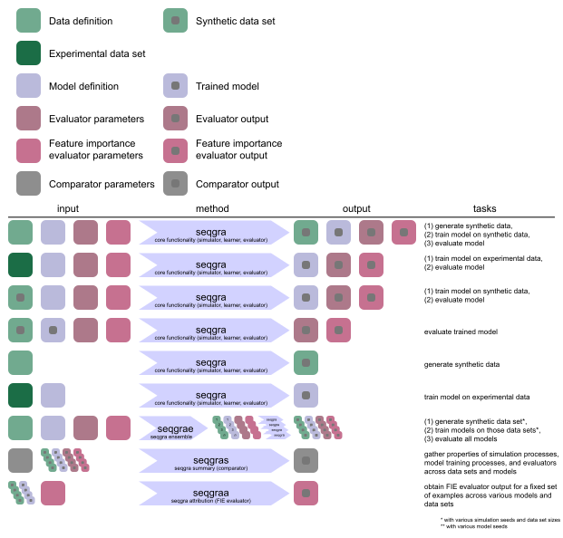

Usage examples
==============

Most use cases are covered by the seqgra CLI commands ``seqgra``, ``seqgras``,
``seqgrae``, and ``seqgraa``.

``seqgra`` command - core functionality:
    covers the core functionality of simulating data, creating 
    models, training models, saving and loading models, evaluating models using
    conventional test set metrics and feature attribution methods

``seqgras`` command - seqgra summary:
    gathers metrics across grammars, 
    models, evaluators

``seqgrae`` command - seqgra ensemble:
    tests model architecture on grammar 
    across various data set sizes, simulation and model seeds

``seqgraa`` command - seqgra attribution:
    used to obtain feature 
    attribution/evidence for selected examples across multiple grammars, 
    models, evaluators

The following schematic shows various seqgra analyses with inputs, outputs, 
and corresponding commands:

For a detailed description of the four seqgra commands and all its parameters,
see :doc:`cmd`.

Commonly used suite of seqgra commands
--------------------------------------

.. code-block:: shell

    seqgra -d DATA_DEFINITION_FILE \
        -m MODEL_DEFINITION_FILE \
        -o OUTPUT_DIR
    seqgra -d DATA_DEFINITION_FILE \
        -m MODEL_DEFINITION_FILE
        -o OUTPUT_DIR
        -e metrics roc pr predict
        --eval-sets training validation test
    seqgra -d DATA_DEFINITION_FILE
        -m MODEL_DEFINITION_FILE
        -o OUTPUT_DIR
        -e sis
        --eval-n-per-label 20
    seqgra -d DATA_DEFINITION_FILE
        -m MODEL_DEFINITION_FILE
        -o OUTPUT_DIR
        -e gradient saliency gradient-x-input integrated-gradients
        --eval-n-per-label 50

#. ``seqgra`` call: generate synthetic data as defined in 
   ``DATA_DEFINITION_FILE`` and create model as defined in 
   ``MODEL_DEFINITION_FILE`` and train it on synthetic data
#. ``seqgra`` call: load previously trained model, call conventional 
   evaluators (metrics, roc, pr, and predict) on all examples of training, 
   validation, and test set
#. ``seqgra`` call: load previously trained model, call SIS evaluator on 20 
   test set examples per label (SIS is the most computationally expensive 
   evaluator)
#. ``seqgra`` call: load previously trained model, call gradient-based 
   evaluators (gradient, saliency, gradient-x-input, and 
   integrated-gradients) on 50 test set examples per label
